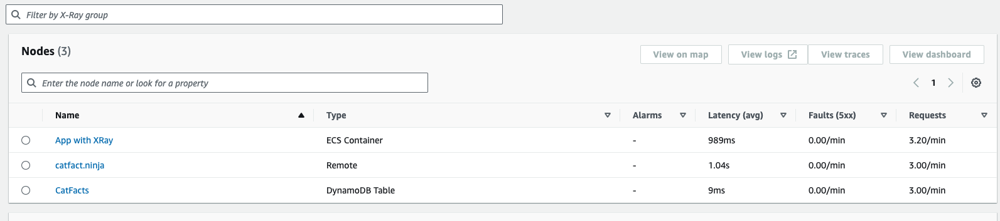
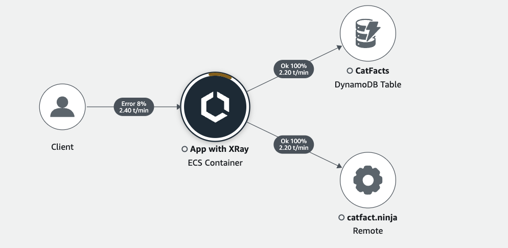
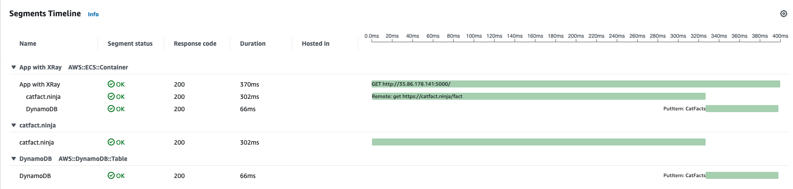

# X-RAY demo

Demo project presenting how to instrument your with flask application with XRAY.
With X-Ray you can measure latencies within and outside of your distributed system
It provides info about:

- requests / min made to and from each component
- average latency, p50, p90
- 500 error count
- list of traces
- trace analysis view

List View


Service Map


Trace View


## Requirements

Dependencies:

- python3.11
- poetry
- terraform
- docker
- aws cli

Other:

- aws account, aws cli with credentials configured and profile

## Deployment

This script will deploy and build all necessary things and give you IP for you to make some calls
After making some API calls, navigate to x-ray console and explore the tool

```sh
./deploy.sh AWS_PROFLE TAG
```

After you finish, remember to clean up after yourself!

```sh
./cleanup.sh AWS_PROFILE
```
